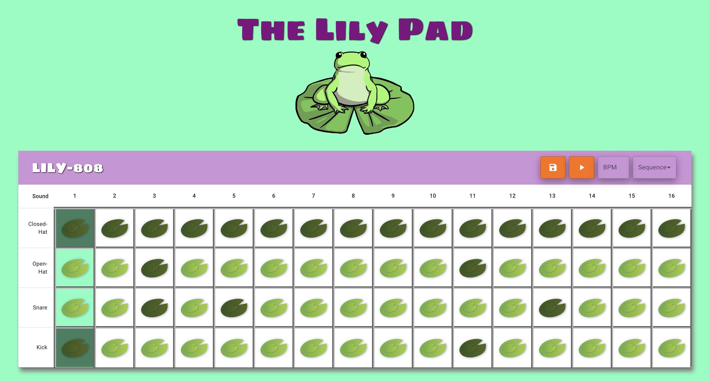

## **The Lily Pad (LILY-808)**
------

## **Live Link**

<h2><a href ="https://warm-oasis-97248.herokuapp.com/">The Lily Pad (LILY-808)</a></h2>

## **Description**

The LILY-808 is a step sequencer for anyone who wants to make beats. It is very simple to understand and accessible to anyone even if they lack formal musical training. The sequencer is based on a 16-step system and each pad when clicked will equate to one 16th note. Each row of pads is associated with a drum sample, closed high-hat, open high-hat, snare-drum, and kick-drum.The user can use the LILY-808 to make a 2 measure drum pattern and have it play back to them. In addition, they can set up the Beats Per Minute (BPM) to control the tempo of the beat. The user is able to use the LILY-808 to store and save their sequences as JSON files for future reference.

## **Installation**
Step 1. In the terminal do a git clone using the repository from this link: https://github.com/msplawn/project-3

Step 2. Install all the required dependencies using the command below:

    npm install

Step 3. Populate the database using the command below:

    npm run seed

Step 4. Run the app using the command below in your terminal:

    npm start

## **Technology Stack**
* HTML 
* CSS
* Tone.js
* Material UI
* React.js
* Express.js
* JavaScript
* Node.js
* Mongo DB
* Mongoose
* Heroku
* GitHub

## **Screenshots**

## **Test**

  

<h3 align ="center"><a href ="https://drive.google.com/file/d/1ShBDNjjtsejvElLwjMp7PKAOgy6lopTu/view">Live Demo</a></h3>

## **Usage**

This application allows a user to to save and create sequences of drum patterns via their web browser.

## **Contributors/Contact**

#### **Jessica Helft** 
* [@KingKitty89](https://github.com/KingKitty89)
* [Portfolio](https://kingkitty89.github.io/react-portfolio/)
* [jessicahelft@gmail.com](jessicahelft@gmail.com)
* [LinkedIn](https://www.linkedin.com/in/jessicahelft)

------

#### **Joe King**  
* [@jking0186](https://github.com/jking0186)
* [Portfolio](https://jking0186.github.io/reactPortfolio/)
* [jking0186@gmail.com](jking0186@gmail.com)
* [LinkedIn](https://www.linkedin.com/in/joe-king-iii-60b9a3173/)

------

#### **Morgan Splawn** 
* [@msplawn](https://github.com/msplawn)
* [Portfolio](https://msplawn.github.io/morgan-splawn-portfolio/)
* [mmsplawn@gmail.com](mmsplawn@gmail.com)
* [LinkedIn](https://www.linkedin.com/in/morgan-splawn-72979a1a9/)

------

#### **John Thomas**  
* [@Dash433](https://github.com/Dash433)
* [Portfolio](https://dash433.github.io/react-portfolio/)
* [john@thomas-household.com](john@thomas-household.com)
* [LinkedIn](https://www.linkedin.com/in/john-thomas-9093b4191/)

